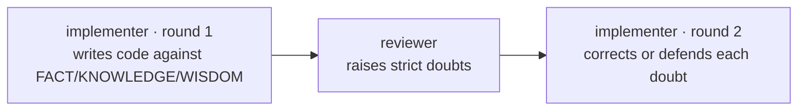

# pastiche

**Coding agents invent components that don't exist in your design system. Pastiche makes them use the ones that do.**

Pastiche is a [Claude Code](https://docs.claude.com/en/docs/claude-code) plugin for faithful design-system execution. Given a frontend task, it produces code that follows your established design system and component library — not by inventing, but by faithfully executing within the vocabulary your team already ships (`<Button variant="primary" size="md">`, not a button it made up).

---

## Quickstart

Install the plugin from this repository's marketplace:

```
/plugin marketplace add retz8/pastiche
/plugin install pastiche@pastiche-marketplace
```

Then, from the root of your frontend project:

```
/pastiche-init      # scaffold pastiche/ docs and extract your component catalog
/pastiche-setup     # interactive walkthrough to teach pastiche your design system
/pastiche <task>    # run a frontend task through the gated loop
```

> **Prerequisite:** Claude Max plan (Opus). Pro users can switch the agent model to Sonnet — unsupported, and it uses more tokens.

---

## How it works

Pastiche replaces a single hand-written design doc with **three documents** that form an epistemological hierarchy — each differs in what it holds, who writes it, and how it lives.

| Document | What it is | Who writes it | Lifecycle |
|---|---|---|---|
| **FACT.md** | Mechanical catalog of every token, component, and prop in your codebase | Auto-extracted by pastiche | Regenerated whenever the codebase changes |
| **KNOWLEDGE.md** | Scenario → component mappings (the "absent designer") plus brand-identity prose | Curated by humans | Grows as new scenarios are codified |
| **WISDOM.md** | Component-intrinsic rules, tagged to the atoms they govern | Curated by humans | Grows as conventions are discovered |

At runtime, pastiche runs a **bounded doubt-defense loop** — depth comes from the dialogue between agents, not from a heavyweight reviewer:



FACT.md is the ground truth for hallucination detection: if generated code uses a component or prop that isn't in FACT.md, the reviewer flags it as invented.

For the full philosophy — the metaphor, the implementer/reviewer asymmetry, and the loop economics — see [`spec.md`](./spec.md).

---

## The workflow

1. **`/pastiche-init`** — scaffolds `pastiche/{config.yaml, FACT.md, KNOWLEDGE.md, WISDOM.md}` and runs the extractor to populate FACT.md from your components and tokens.
2. **`/pastiche-setup`** — an interactive session that fills KNOWLEDGE.md (scenario mappings, brand identity) and seeds WISDOM.md with general rules.
3. **`/pastiche <task>`** — runs the doubt-defense loop on a frontend task and produces design-system-faithful code.
4. **Maintain over time** — re-extract with `/pastiche-sync` after codebase changes, and extend your design knowledge with `/pastiche-write-knowledge` and `/pastiche-write-wisdom` as new scenarios appear.

---

## What's inside

**Skills**

| Command | What it does |
|---|---|
| `/pastiche` | Run a frontend task through the doubt-defense loop |
| `/pastiche-init` | Scaffold the three documents and extract FACT.md |
| `/pastiche-setup` | Interactive setup: fill KNOWLEDGE.md, seed WISDOM.md |
| `/pastiche-sync` | Re-extract FACT.md after codebase changes |
| `/pastiche-lint` | Cross-document consistency check |
| `/pastiche-write-knowledge` | Add a curated scenario → component mapping |
| `/pastiche-write-wisdom` | Add a component-intrinsic rule |

**Agents** (internal — orchestrated by the loop, not called directly): `pastiche-implementer-round1`, `pastiche-reviewer`, `pastiche-implementer-round2`.

---

## Philosophy

A *pastiche* is a work that openly imitates the style of a master — not a forgery, but a disciplined suppression of personal style in service of fidelity. That is exactly what a frontend implementer must do inside a design system: not invent, not deviate, but execute faithfully within an established vocabulary. In this domain, creativity is often the failure mode.

Read more in [`spec.md`](./spec.md).

---

## Status

**v1.** Validated end-to-end on Claude Code. Codex CLI adapter files ship as a placeholder — the shape is in place, but runtime correctness is unverified; community validation is welcome.

---

## License

[MIT](./LICENSE) © 2026 Jioh In
