# Pastiche × Primer: a GitHub clone

This is a working GitHub clone, built on [Primer](https://primer.style),
GitHub's own design system. Every screen was produced by **[pastiche](https://github.com/retz8/pastiche)**
from a plain-language description of what the page should do. No screen was designed pixel-by-pixel,
and no generated code was hand-edited afterward.


## What you're looking at

This app adopts **`@primer/react`** as its component library and takes its design posture from
**primer.style**, GitHub's published design philosophy: functional, restrained, engineer-facing;
one primary action per surface; reach for an existing component before writing custom CSS.

Pastiche read that system once and wrote down everything that exists in it:

> **`149` components · `1113` tokens** catalogued from Primer.

That catalog is the entire reference the tool worked from, plus two short, hand-written guides
describing *how* the system is meant to be used (see [The guides that drove it](#the-guides-that-drove-it)).
No mockups, no Figma, no per-page art direction.


## The pages

Each page below was generated by handing Pastiche a single plain-language task, the kind of brief
a product manager or designer might write in a ticket. The exact wording is reproduced under
**Task prompt** on each page; the screenshot is what came out.

The prompts describe **intent** ("labels as colored tags",
"a danger zone that's visually distinct", "open and closed issues should be visually
distinguishable"), never specific components, colors, or measurements. Pastiche makes those
choices, and makes them the way the design system intends.

Full prompt set: [`pastiche-task-prompts.md`](docs/pastiche-task-prompts.md).

> **A note on honesty.** None of the *generated code* was edited by hand. But the two docs that
> pastiche reads (`KNOWLEDGE.md` and `WISDOM.md`) were refined across several runs as gaps surfaced.
> That's how pastiche is meant to be used, and how it gets sharper over time. The screenshots here
> are the output once those docs had settled.


### Issues

#### Issues List — `/issues`
| Real GitHub | Pastiche |
|---|---|
| 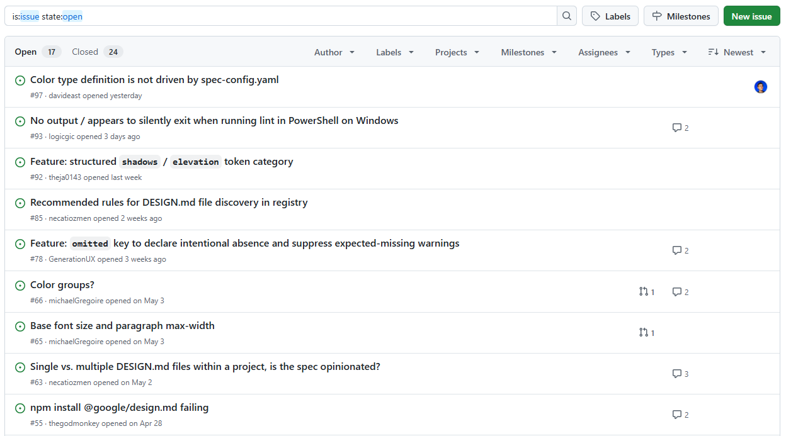 | 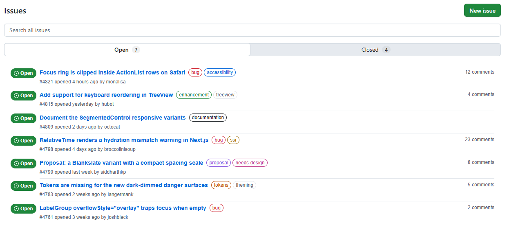 |

<details><summary>Task prompt</summary>

> Build the Issues List page at `/issues`.
>
> The page lets users browse issues in a repository. At the top, a search/filter bar and a
> "New issue" button. Below that, Open/Closed tabs with counts so users can toggle between the two
> sets. The main body is the issue list — each row surfaces the issue title (linked to its detail
> page), any labels as colored tags, the issue number, who opened it, when, and how many comments it
> has. Open and closed issues should be visually distinguishable.
>
> When no issues match the current filter, show an empty state that helps the user move forward.
>
> Use hardcoded mock data — 8–12 issues with a mix of open/closed, varied labels, and different
> ages. No API calls.

</details>

#### New Issue — `/issues/new`
| Real GitHub | Pastiche |
|---|---|
| 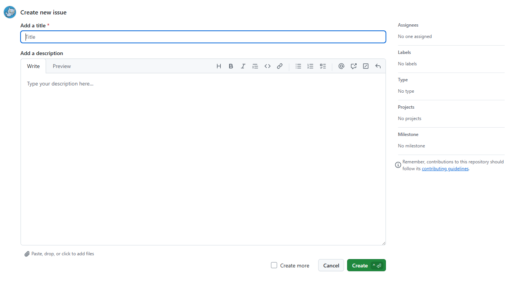 | 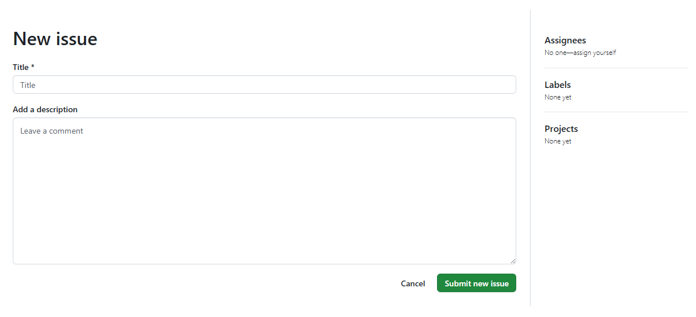 |

<details><summary>Task prompt</summary>

> Build the New Issue composer page at `/issues/new`.
>
> This is a two-column layout. The main column has a title field (required) and a large body textarea
> for the description. The sidebar column has metadata sections — Assignees, Labels, Projects — each
> showing a placeholder state ("No one", "None yet") since nothing is selected. The sections are
> visually separated.
>
> At the bottom of the form, a submit button and a cancel action that returns to the issues list. If
> the user tries to submit without a title, show a validation error.
>
> No real persistence — submitting just navigates back to `/issues`.

</details>

#### Issue Detail — `/issues/[id]`
| Real GitHub | Pastiche |
|---|---|
| 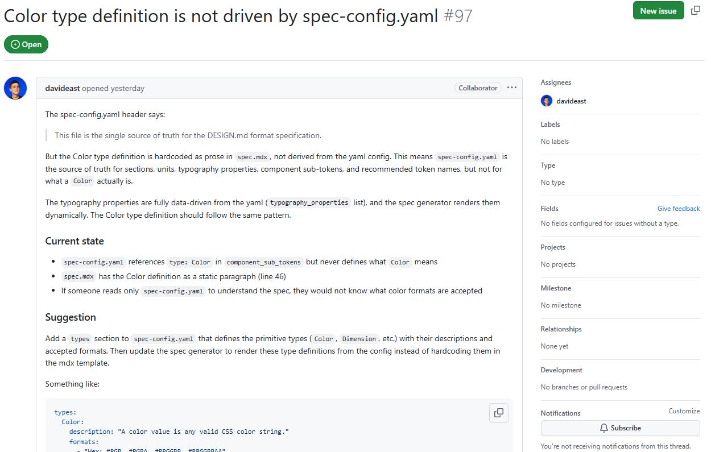 | 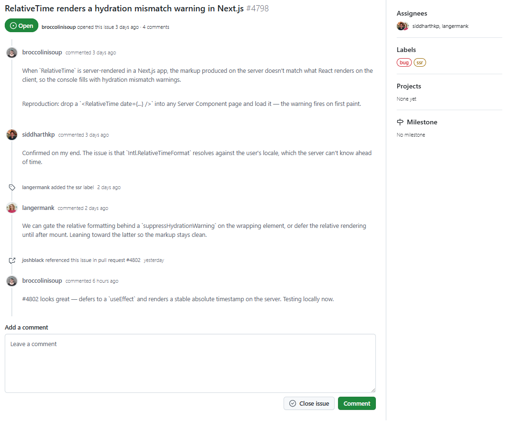 |

<details><summary>Task prompt</summary>

> Build the Issue Detail page at `/issues/[id]`.
>
> The page header shows the issue title alongside its number, plus a status indicator (open or
> closed) and a byline ("opened this issue 3 days ago · 4 comments").
>
> The main content area is a conversation thread. The opening post looks like a comment — author
> avatar, name, timestamp, and body text. Below it, a timeline mixes follow-up comments from
> different users with event entries (label added, issue closed, etc.). Each comment has the same
> avatar/name/timestamp/body shape. Events are lighter — a small icon, a one-line description, and a
> timestamp.
>
> At the bottom of the thread, a comment composer with a textarea and action buttons — "Comment" to
> post, and a secondary action to close or reopen the issue depending on current state.
>
> The sidebar (right column on desktop, below on narrow) shows metadata: assigned users with
> avatars, labels as colored tags, and placeholder slots for Projects and Milestone.
>
> Use hardcoded mock data matching one of the issues from the list page. Nothing needs to actually
> persist or function — the UI just needs to be present and correct.

</details>


### Pull Requests

#### Pull Requests List — `/pulls`
| Real GitHub | Pastiche |
|---|---|
| 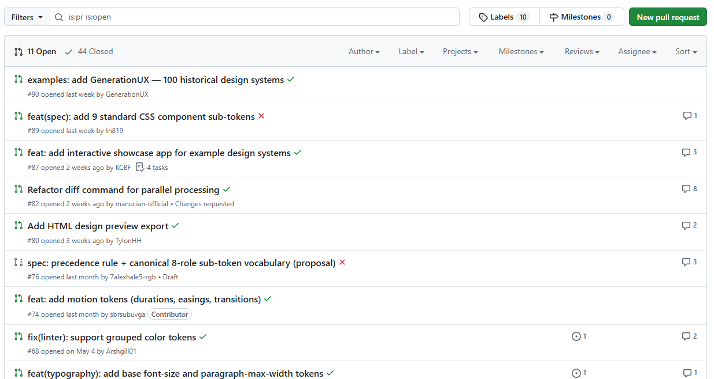 | 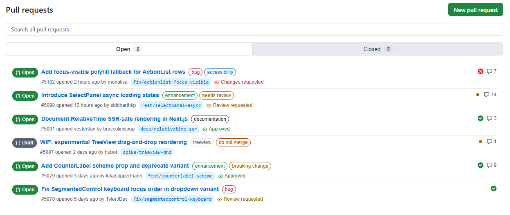 |

<details><summary>Task prompt</summary>

> Build the Pull Requests List page at `/pulls`.
>
> The page lets users browse pull requests in a repository. At the top, a search/filter bar and a
> "New pull request" button. Below that, Open/Closed tabs with counts. Each row in the list shows the
> PR title (linked to its detail page), the PR number, who opened it, when, and how many comments it
> has. Each PR also surfaces its source branch name, any labels, and review status — whether reviews
> have been requested, approved, or changes requested. Some PRs should show CI check status
> indicators (passing, failing, pending).
>
> When no pull requests match the current filter, show an empty state.
>
> Use hardcoded mock data — 8–12 pull requests with a mix of open/closed/merged, varied review
> states, different CI statuses, and different branches. No API calls.

</details>

#### Pull Request Conversation — `/pulls/[id]`
| Real GitHub | Pastiche |
|---|---|
| 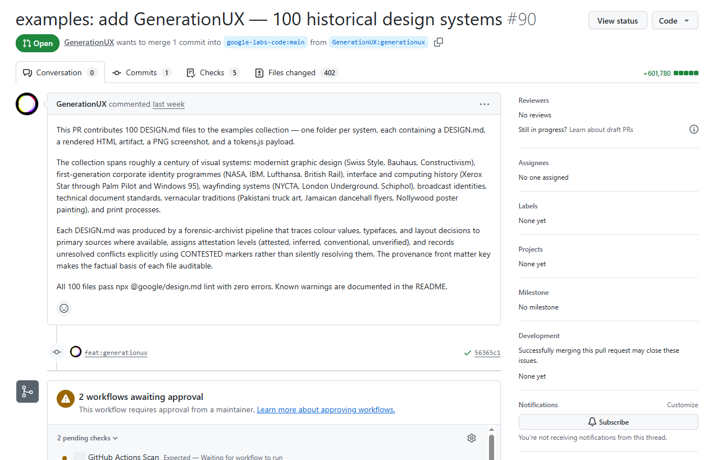 | 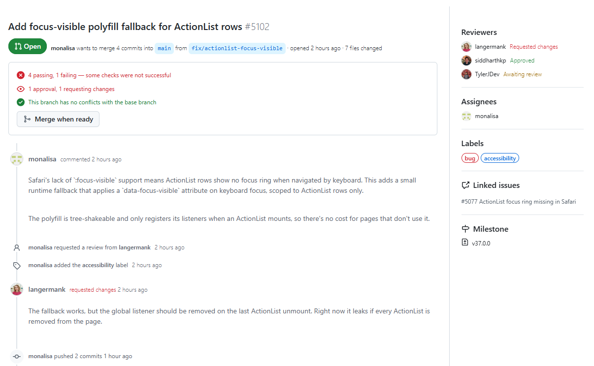 |

<details><summary>Task prompt</summary>

> Build the Pull Request Conversation page at `/pulls/[id]`.
>
> The page header shows the PR title alongside its number, a status indicator (open, closed, or
> merged), and a byline with who opened it, the source and target branch names, and how many commits
> and files changed.
>
> Below the header, a merge status area summarizes the current state: CI check results (some passing,
> some failing), review approvals, and whether the branch has conflicts. A merge button reflects the
> available merge action based on those conditions.
>
> The main content area is a conversation thread. The opening post is the PR description — author
> avatar, name, timestamp, and body. Below it, a timeline mixes review comments, review summaries
> (approved / changes requested), commit pushes, and event entries (reviewer added, label applied,
> branch updated). Comments have the same avatar/name/timestamp/body shape. Events are lighter — a
> small icon, a one-line description, and a timestamp.
>
> At the bottom of the thread, a comment composer with a textarea and action buttons — one to
> comment, and secondary actions to approve or request changes.
>
> The sidebar shows metadata: reviewers with their review status, assignees, labels, linked issues,
> and the target milestone.
>
> Use hardcoded mock data matching one of the PRs from the pull requests list page. No persistence
> needed.

</details>


### Code

#### Repository Home — `/`
| Real GitHub | Pastiche |
|---|---|
| 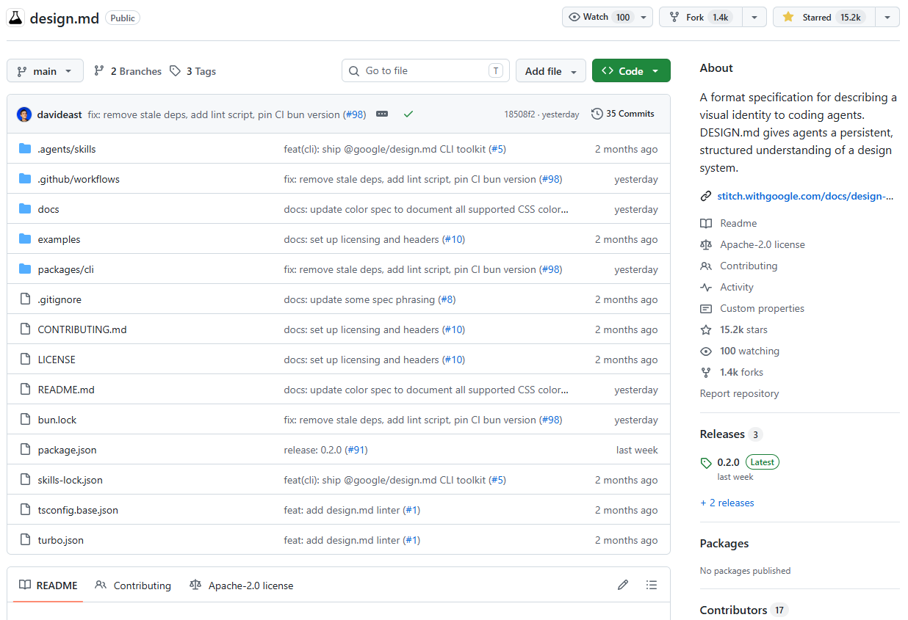 | 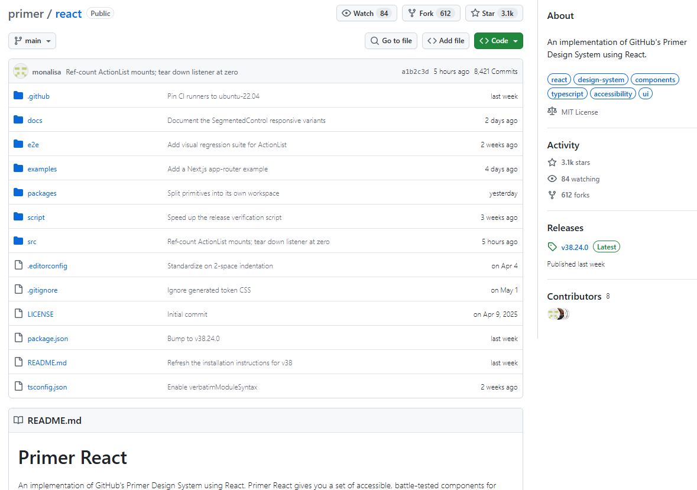 |

<details><summary>Task prompt</summary>

> Build the Repository Home page at `/`.
>
> The top area shows repository metadata: the repo name, visibility badge (public/private), and
> star/fork/watch counts with action buttons for each.
>
> Below that, a bar shows the current branch, a branch/tag selector, and buttons to find files and
> add files. A "Code" dropdown for cloning (HTTPS/SSH/CLI) should be present.
>
> The main content area has a file/folder listing in a table. Each row shows a file or directory
> icon, the name (linked), the latest commit message that touched it, and a relative timestamp.
> Directories sort before files. Above the table, the latest commit is summarized — author avatar,
> message, commit hash, and total commit count.
>
> Below the file listing, the README is rendered. It should contain a project title, a short
> description, installation instructions, and a usage section — typical open-source README content.
>
> The sidebar shows an About section with a short description, topics/tags, a license badge, activity
> stats (stars, forks, watchers), release info, and a list of contributors as avatars.
>
> Use hardcoded mock data for the file tree (10–15 entries with a mix of files and directories),
> commit info, and README content. No API calls.

</details>

#### Code File Viewer — `/blob/[...path]`
| Real GitHub | Pastiche |
|---|---|
| 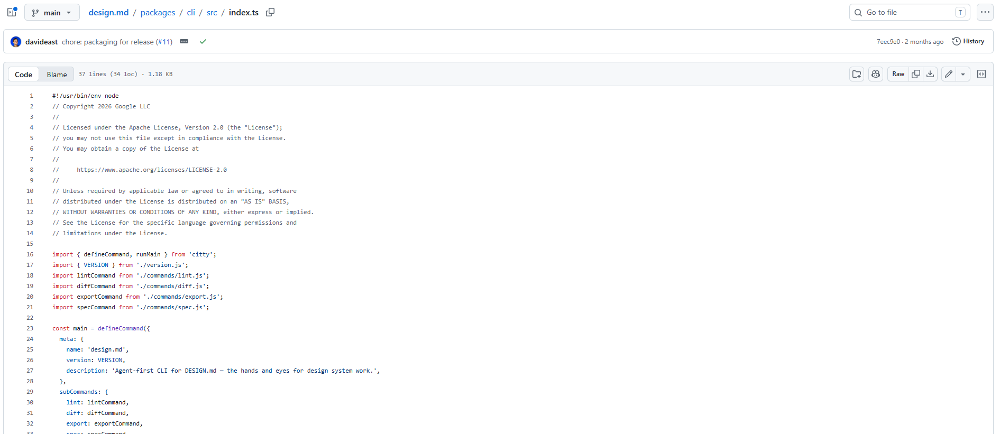 | 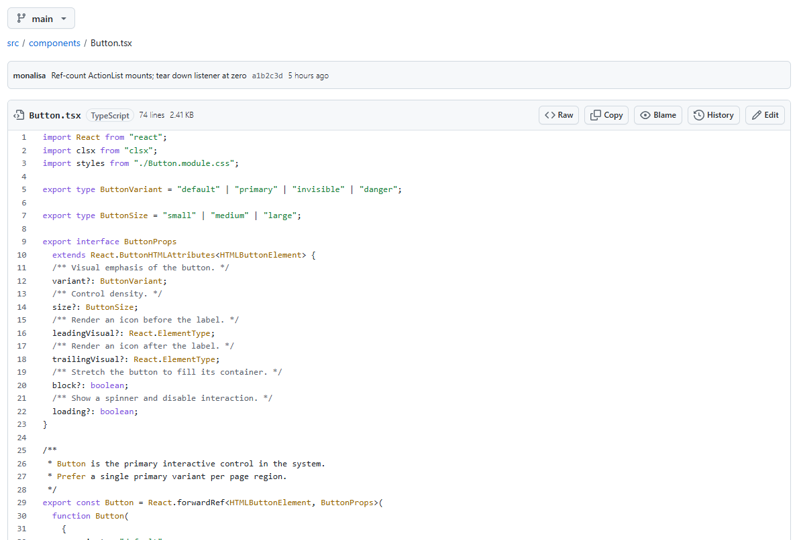 |

<details><summary>Task prompt</summary>

> Build the Code File Viewer page at `/blob/[...path]`.
>
> The page should be in fullbleed layout. fill in the full width of the screen. also, wire the page
> with layout's navigation bar "Code". If user clicks "Code", then navigate to blob page.
>
> The top of the page shows a breadcrumb path reflecting the file's location in the repo tree (e.g.,
> `src / components / Button.tsx`). Each segment of the path is a link.
>
> Below the breadcrumb, a file metadata bar displays the file name, the line count, the file size,
> and action buttons for viewing raw content, blame, history, and editing. A branch/tag selector
> shows which ref the file is being viewed from.
>
> The main body is the file content rendered with line numbers. Each line number is its own element
> so users can reference specific lines. The code should have syntax highlighting appropriate to the
> file type.
>
> Above the file content, the latest commit that touched this file is shown — commit message, author,
> and relative timestamp.
>
> Use hardcoded mock data — a realistic source file of 40–60 lines (a React component or utility). No
> API calls.

</details>


### Actions

#### Workflow Runs — `/actions`
| Real GitHub | Pastiche |
|---|---|
| 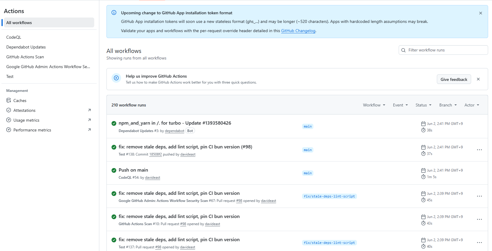 | 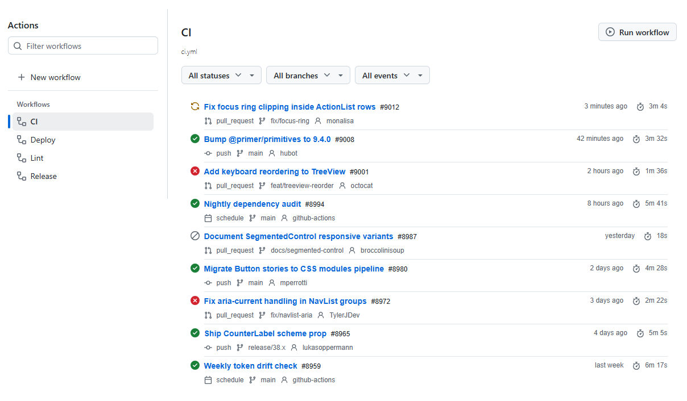 |

<details><summary>Task prompt</summary>

> Build the Actions page at `/actions`.
>
> A sidebar lists the repository's workflows by name (e.g., "CI", "Deploy", "Lint"). One workflow is
> selected. The sidebar also shows a search field to filter workflows, and a "New workflow" link.
>
> The main content area shows the run history for the selected workflow. Each row displays the run
> status (success, failure, in progress, cancelled), the commit message or run title, the triggering
> event (push, pull_request, schedule), the branch, the actor who triggered it, and how long ago it
> ran with its duration.
>
> Above the list, a filter bar lets users filter runs by status, branch, and event type. A "Run
> workflow" button allows manual triggering.
>
> When a workflow has no runs, show an empty state.
>
> Use hardcoded mock data — 3–4 workflows in the sidebar, 8–10 runs for the selected workflow with a
> variety of statuses, branches, and events. No API calls.

</details>

#### Workflow Run Detail — `/actions/runs/[id]`
| Real GitHub | Pastiche |
|---|---|
| 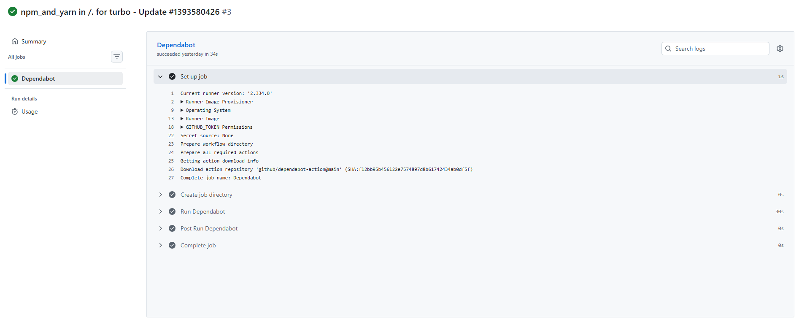 | 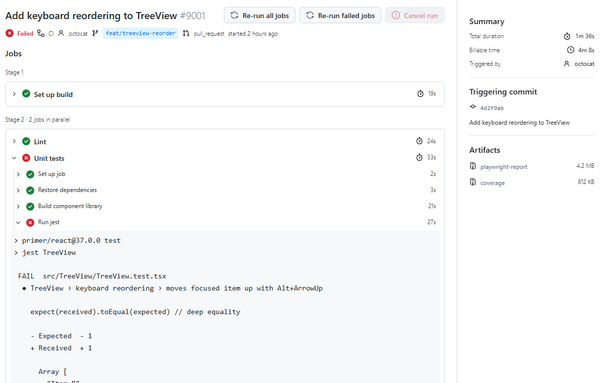 |

<details><summary>Task prompt</summary>

> Build the Workflow Run Detail page at `/actions/runs/[id]`.
>
> The page header shows the run title (usually the commit message), the workflow name, the run
> status, and metadata — who triggered it, from which branch, the triggering event, and when it
> started.
>
> Below the header, action buttons for re-running the workflow (all jobs or just failed ones) and
> cancelling an in-progress run.
>
> The main content area shows the jobs in this run. Each job has a name, a status indicator, and a
> duration. Jobs are presented in a visual structure that reflects their dependency order — some run
> in parallel, some sequentially after others.
>
> Expanding or navigating to a job shows its step-by-step log. Each step has a name, a status, a
> duration, and an expandable log output area. Log output is monospaced text. Some steps should be
> expanded by default (especially failed ones), and others collapsed.
>
> A sidebar or summary area shows the run's metadata: total duration, billable time, the triggering
> commit (hash + message), and any artifacts produced by the run.
>
> Use hardcoded mock data — one run with 3–4 jobs, each having 4–6 steps with realistic log output.
> At least one job should be in a failed state. No API calls.

</details>


### Settings

#### General Settings — `/settings`
Cropped to the **danger zone**, the part the prompt asks to set visually apart.

| Real GitHub | Pastiche |
|---|---|
| 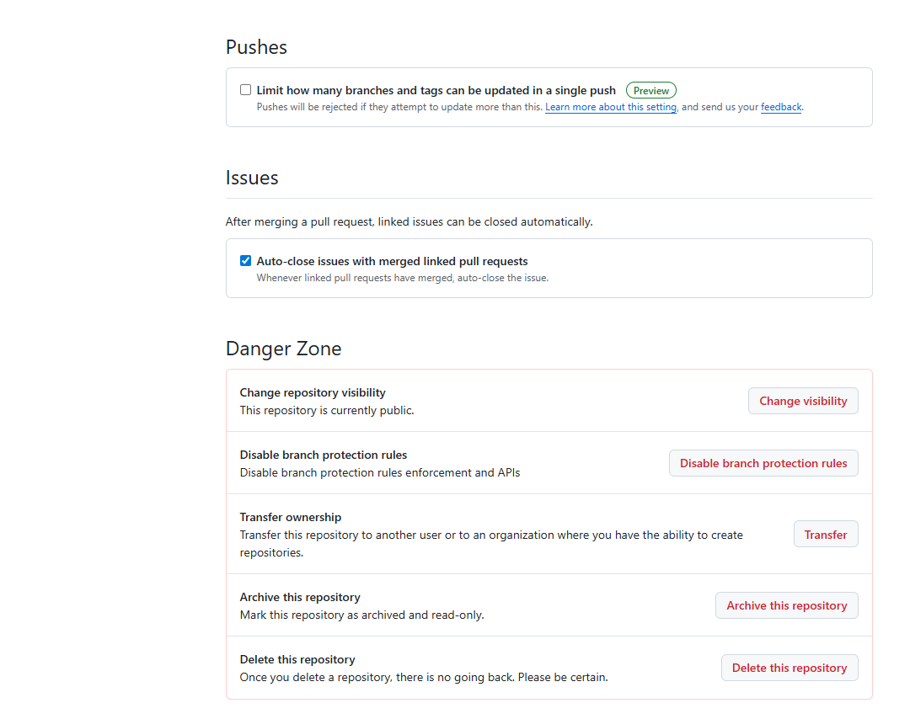 | 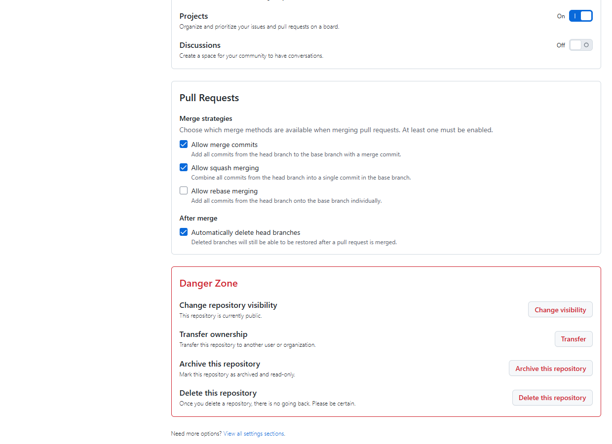 |

<details><summary>Task prompt</summary>

> Build the General Settings page at `/settings`.
>
> The page has a sidebar navigation listing settings sections — General, Access, Branches, Tags,
> Actions, Pages, and others. General is the currently active section.
>
> The main content area is a form divided into clearly separated sections.
>
> The first section covers the repository name, with a field to rename the repo and a note about the
> implications of renaming. Below that, a description/website field and topic tags.
>
> A features section has toggles for enabling or disabling specific repository features — Wikis,
> Issues, Projects, Discussions. Each toggle has a short explanation of what it controls.
>
> A pull requests section has checkboxes for allowed merge strategies — merge commits, squash
> merging, rebase merging — with options to auto-delete head branches after merge.
>
> At the bottom, a danger zone section is visually distinct and contains destructive actions:
> changing repository visibility, transferring ownership, archiving, and deleting the repository.
> Each action has a button and a short warning.
>
> No persistence — interacting with controls does not need to save anything. The UI just needs to be
> present and correct.

</details>


## The guides that drove it

Pastiche didn't invent any of this from imagination. Everything above traces back to three
documents: one written by a machine, two written by a person.

| Document | What it is | In this example |
|---|---|---|
| `FACT.md` | The catalog of what exists in the design system, read straight from the code. Never hand-written. | `149` components · `1113` tokens |
| `KNOWLEDGE.md` | The designer's judgment, written down: *in this situation, use these components.* Curated by hand. | `51` scenarios across 12 sections |
| `WISDOM.md` | The rules that can't be read off the code, like *"only one primary button per area," "never use a raw color."* Curated by hand. | `20` rules |

If you're a designer, these last two are the interesting part. They're where your judgment lives.
A few of the actual entries that shaped the pages above:

**From `KNOWLEDGE.md`, situation → component:**
```markdown
Primary call-to-action on a page — the single most important action the user should take.
→ `Button` variant="primary"

Destructive action that requires confirmation before proceeding (e.g., delete, close permanently).
→ `Button` variant="danger"
→ `ConfirmationDialog` confirmButtonType="danger"

Empty state placeholder when a list or page has no content yet — guiding the user toward a first action.
→ `Blankslate`
→ `Blankslate.Visual`
→ `Blankslate.Heading`
→ `Blankslate.PrimaryAction`
```

**From `WISDOM.md`, always-true rules:**
```markdown
- [GENERAL] Never use raw hex, rgb, or px values; always reference Primer design tokens (`--fgColor-*`, `--bgColor-*`, `--borderColor-*`, `--shadow-*`).
- [Button] Never render more than one variant="primary" Button in a single button group or page region. Primary is the single highest-priority action.
- [FormControl] Never disable or hide the submit button, even when the form is invalid. Disabled buttons break keyboard navigation and leave users without feedback on what went wrong.
```

And `config.yaml` points pastiche at this app's library and tokens. `FACT.md` is generated from it:
```yaml
platform: claude-code

packages:
  - name: "@primer/react"
    types:
      - "node_modules/@primer/react/dist/index.d.ts"
      - "node_modules/@primer/react/dist/experimental/index.d.ts"

tokens:
  - node_modules/@primer/primitives/dist/css/functional/size/size.css
  - node_modules/@primer/primitives/dist/css/functional/spacing/space.css
  - node_modules/@primer/primitives/dist/css/functional/typography/typography.css
  # ...and the rest of Primer's functional token CSS
```

See the full set under [`pastiche/`](pastiche/).


## Reproduce it

```bash
cd examples/github-primer-react
npm install
npm run dev
```

The app's pastiche config (the `pastiche/` folder with FACT/KNOWLEDGE/WISDOM) is already committed.
To regenerate any page from scratch, launch Claude Code from this app's root with the bundled
pastiche plugin loaded:

```bash
claude --plugin-dir ../../dist/claude-code
```

Then, inside the session, run `/pastiche` with any task prompt from above:

```
/pastiche <paste any task prompt from above>
```

> **Note.** The pastiche plugin ships in this repo at `dist/claude-code`, so no separate
> install is needed. See the [main repository](https://github.com/retz8/pastiche) for details.


→ Back to the [pastiche main repository](https://github.com/retz8/pastiche).